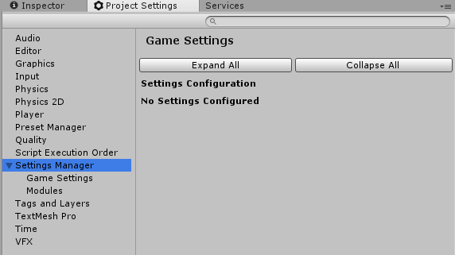
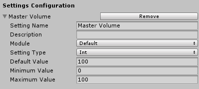
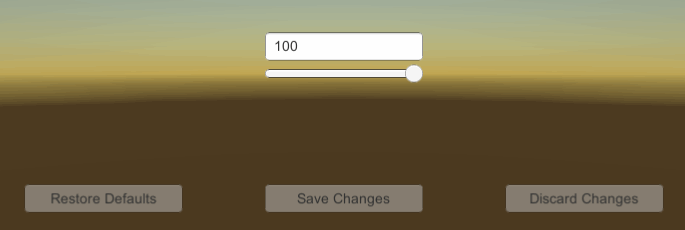

This guide will run through everything you need to know to get started using Loris Settings Manager by showing you how to:
- Configure a setting
- Use that setting in your code
- Create a settings menu to control that setting

##  Installing 
If you haven't already, you will need to add the Loris Settings Manager to your Unity Project by downloading it from the [Asset Store](https://assetstore.unity.com/). Make sure you import the entire package into your project and not just a couple of files.

## Configure Settings
To begin configuring your game settings, you will need to go to `Edit -> Project Settings` in the Unity Editor and open up the **Settings Manager** header. There you will see two subheaders; **Game Settings** and **Modules**.

**Modules** are optional and can be used to create multiple separate settings menus, such as Video Settings and Audio Settings. 

**Game Settings** is where you set up the settings that will be available. Open it up and click the **Add Setting** button to create your first custom setting. 

Configure your new setting as below:

## Accessing Settings
Once you have configured your settings in the editor, you're ready to start referencing them in your code. This is done using a static class named `GameSettings`. You will need to add a reference to the `UtilityLoris` namespace, and from there you can do the following:

    GameSettings.GetIntValue("Master Volume");

You could also use the OnSave event to write a manager script for your audio devices, for example:

    private AudioSource[] _audioSources;

    public void Awake()
    {
        var volumeSetting = GameSettings.GetEditableIntSetting("Master Volume");
        SetVolume(volumeSetting.GetValue());
        volumeSetting.OnSave += SetVolume;
    }

    private void SetVolume(int? value)
    {
        var volume = (float)value / 100;
        foreach (var audioSource in _audioSources)
        {
            audioSource.volume = volume;
        }
    }

This script would make it so that any time a change to the master volume setting was saved, it would be propagated out to your audio sources. You may have a different, possibly more complex setup than this in your game, but this provides a good example of how you might implement your code.

## Creating Your First Menu
To create a settings menu, you will first need to add a menu manager to your Unity Scene. Add a `SettingsMenuManager` component to an object in your scene, for example the root canvas of your menu UI and inspect the module you wish to use from the dropdown.

Next you will need to create your inputs:

 1. Create two inputs in your scene; a `Slider` and an `Input Field`
 2. Select your newly created `Slider` and add a `SliderBinder`component. In the inspector, select **Int** for the **Value Type** and **Master Volume** for the **Bound Setting**
 3. Select the previously created `Input Field` and add an `InputFieldBinder` component. Configure the inspector the same way you did for the slider.

If you run the scene now, you should find that when you adjust the slider, the contents of the text box change, and vice versa!

To finish, we want to add some basic menu functionality - the ability to save changes, discard changes and restore defaults. To do this, you can do the following:

 1. Create three buttons
 2. Add a `SaveChangesButton` component, `DiscardChangesButton` component and `RestoreDefaultsButton` component to each of the buttons respectively
 3. For each of the components, make sure to add the`SettingsMenuManager` component from your scene to their configuration in the inspector

If you run the scene now, you should have three buttons that allow you to control your menu. The **Save Changes Button** will be disabled when nothing is modified or the settings are invalid, the **Discard Changes Button** will be disabled when nothing is modified and the **Restore Defaults Button** will be disabled when all settings match their default values.

## Summary 
If you've followed this guide exactly, you should have the following:

 - An integer setting called **Master Volume** in the **Default** module
 - A scene containing a `SettingsMenuManager`, configured to manage the **Default** module
 - Two inputs (an `Input Field` and `Slider`) both bound to the **Master Volume** setting
 - Save Changes, Discard Changes and Restore Defaults buttons all assigned to control our `SettingsMenuManager`

This should give you a fully working settings menu, albeit one that only allows you to control one setting. From here you can add as many as you like.